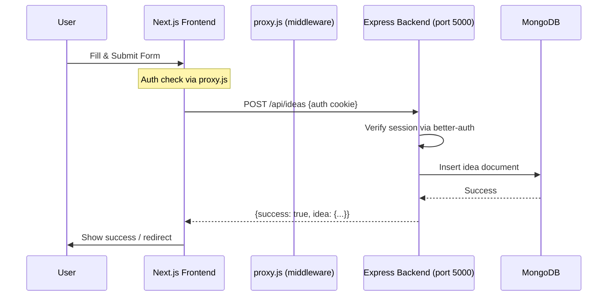
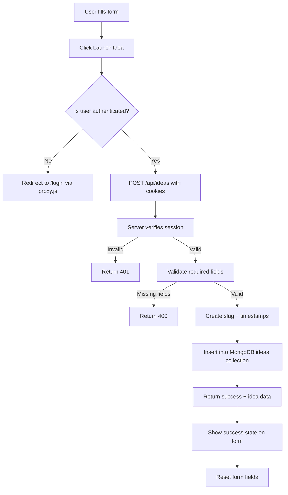

# Add-Idea MongoDB Integration Plan

## Overview

Connect the existing idea submission form in the Next.js frontend to the Express.js backend, saving ideas to MongoDB and providing a GET endpoint to retrieve them.

## Architecture



## Dependency Versions (Context7 Verified)

| Package | Current | Latest Available | Action |
|---------|---------|-----------------|--------|
| express | ^5.2.1 | 5.2.0 (stable) | Keep or install latest |
| mongodb | ^7.2.0 | 7.2.x branch | Keep |
| cors | ^2.8.6 | Latest | Keep |
| dotenv | ^17.4.2 | Latest | Keep |
| better-auth | ^1.6.11 | Latest | Keep |

## Detailed Steps

### Step 1: Create Express Routes for Ideas

**File:** `C:\Programming Hero\IdeaVault-web\ideavault_server\routes\ideas.js`

Create a new file with two endpoints:

#### POST /api/ideas (Authenticated)
- **Purpose:** Accept form data, validate, insert into MongoDB `ideas` collection
- **Auth:** Verify session using `auth.api.getSession()` with `fromNodeHeaders()`
- **Body fields:** `title`, `shortDesc`, `detailedDesc`, `category`, `tags`, `imageUrl`, `budget`, `targetAudience`, `problemStatement`, `proposedSolution`
- **Auto fields:** `userId` (from session), `createdAt`, `updatedAt`, `slug` (URL-friendly title)
- **Validation:** At minimum, `title` and `shortDesc` required; return 400 if missing
- **Response:** `{ success: true, idea: { ...insertedIdea } }`

#### GET /api/ideas (Public)
- **Purpose:** Return list of all ideas, sorted by `createdAt` desc
- **Auth:** Public endpoint (no auth required)
- **Query params:** Optional `limit`, `skip`, `category` filter
- **Response:** `{ success: true, ideas: [...], total: number }`

### Step 2: Register Routes in index.js

Modify `C:\Programming Hero\IdeaVault-web\ideavault_server\index.js`:
- Add `const ideasRouter = require("./routes/ideas");` at top
- Add `app.use("/api/ideas", ideasRouter);` **after** `app.use(express.json())` (critical for body parsing)
- The auth route `app.all("/api/auth/{*any}", ...)` must remain before `express.json()` (better-auth handles its own parsing)

### Step 3: Update Frontend Form Submission

Modify `src/app/add-idea/page.jsx`:

1. **Add state variables:**
   - `const [loading, setLoading] = useState(false);`
   - `const [error, setError] = useState(null);`

2. **Update `handleSubmit`:**
   ```js
   const handleSubmit = async (e) => {
     e.preventDefault();
     setLoading(true);
     setError(null);
     
     try {
       const res = await fetch("http://localhost:5000/api/ideas", {
         method: "POST",
         headers: { "Content-Type": "application/json" },
         credentials: "include",  // sends cookies for auth
         body: JSON.stringify({
           title: form.title,
           shortDesc: form.shortDesc,
           detailedDesc: form.detailedDesc,
           category: form.category,
           tags,
           imageUrl: form.imageUrl || undefined,
           budget: form.budget ? Number(form.budget) : undefined,
           targetAudience: form.targetAudience,
           problemStatement: form.problemStatement,
           proposedSolution: form.proposedSolution,
         }),
       });
       
       const data = await res.json();
       
       if (!res.ok) {
         throw new Error(data.error || "Failed to submit idea");
       }
       
       setSubmitted(true);
       // Reset form after success
       setForm({ title: "", shortDesc: "", detailedDesc: "", category: "", imageUrl: "", budget: "", targetAudience: "", problemStatement: "", proposedSolution: "" });
       setTags([]);
       setTimeout(() => setSubmitted(false), 3000);
     } catch (err) {
       setError(err.message);
     } finally {
       setLoading(false);
     }
   };
   ```

3. **Add error display** in the form UI
4. **Disable submit button** during loading

### Step 4: MongoDB Document Schema

The `ideas` collection document structure:

```json
{
  "_id": ObjectId,
  "userId": "user_id_from_auth",
  "title": "string",
  "slug": "string (auto-generated from title)",
  "shortDesc": "string",
  "detailedDesc": "string",
  "category": "string",
  "tags": ["string"],
  "imageUrl": "string (optional)",
  "budget": "number (optional)",
  "targetAudience": "string",
  "problemStatement": "string",
  "proposedSolution": "string",
  "createdAt": ISODate,
  "updatedAt": ISODate
}
```

### Step 5: Indexes

Create index on `userId` and `createdAt` for efficient queries:
- `{ userId: 1 }` - for user's own ideas
- `{ createdAt: -1 }` - for sorting by newest

## Flow Diagram



## File Changes Summary

| File | Action | Description |
|------|--------|-------------|
| `ideavault_server/routes/ideas.js` | **CREATE** | New Express router with POST and GET /api/ideas |
| `ideavault_server/index.js` | **MODIFY** | Register the ideas router after express.json() |
| `ideavault_server/auth.js` | **MODIFY** | Export the `db` instance so ideas route can use it |
| `src/app/add-idea/page.jsx` | **MODIFY** | Update handleSubmit to call API, add loading/error states |

## Edge Cases & Error Handling

1. **Network failure:** Show "Unable to reach server. Please try again."
2. **Auth token expired:** Return 401; frontend redirects to login
3. **Duplicate submissions:** Disable button during loading (prevent double-click)
4. **MongoDB connection error:** Return 500 with generic message
5. **Very long tags:** Server-side truncation/clamp at 25 chars
6. **Invalid budget (negative):** Allow but store as-is; validation is client-side
7. **Empty tags array:** Store empty array, not null
